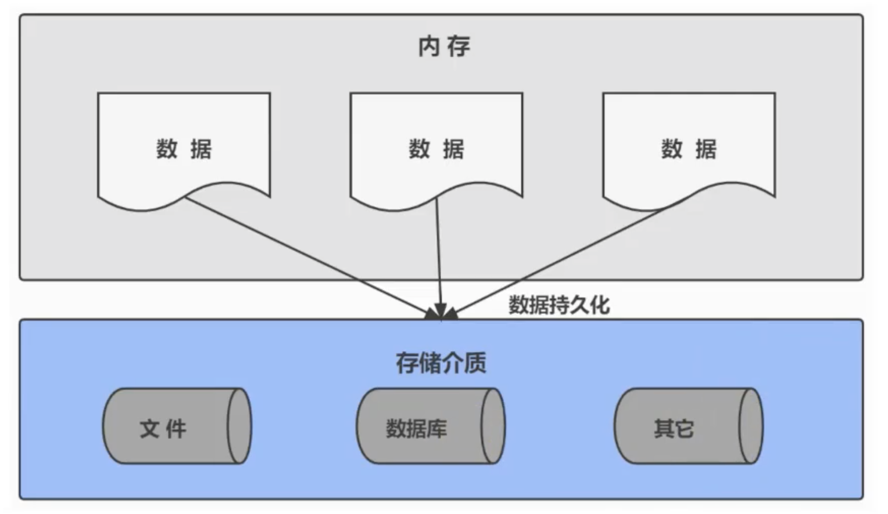

# 第01章-为什么要使用数据库？

- 持久化

把数据保存到可掉电的存储设备中，以供以后使用。大多数情况下，特别是企业应用，数据持久化意味着将内存中的数据保存在硬盘上加以“固化”，而持久化的实现过程大多是通过关系数据库。

持久化的主要作用是将内存中的数据存储在关系型数据库中，当然也可以存储到磁盘、XML数据文件中。

总结来说，为什么要学习数据库？因为数据库可以实现数据的持久化。

> 02-07:26
