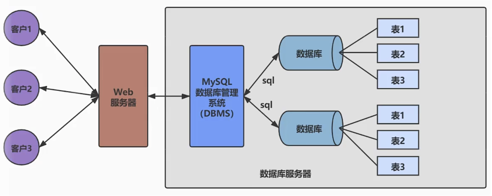
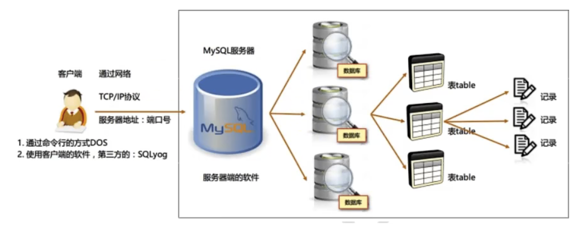

# 第01章-数据库概述

## 一、为什么要使用数据库？

- 持久化

把数据保存到可掉电的存储设备中，以供以后使用。大多数情况下，特别是企业应用，数据持久化意味着将内存中的数据保存在硬盘上加以“固化”，而持久化的实现过程大多是通过关系数据库。

持久化的主要作用是将内存中的数据存储在关系型数据库中，当然也可以存储到磁盘、XML数据文件中。

总结来说，为什么要学习数据库？因为数据库可以实现数据的持久化，而数据库是我们典型的数据持久化介质。

## 二、数据库与数据库管理系统

### 2.1 数据库的概念

- DB（Database）

即存储数据的仓库，其本质是一个文件存储系统，它保存了一系列有组织的数据。

- DBMS（database Management System）

数据库管理系统是一种操作和管理数据的大型软件，用于建立、使用和维护数据库，对数据库进行统一的管理和控制。用户通过数据库管理系统访问数据库中表内的数据。

- SQL（Struct Query Language）

专门用于与数据库通信的语言。

### 2.2 数据库与数据库管理系统的关系

数据库管理系统（DBMS）可以管理多个数据库，一般开发人员会针对每一个应用创建一个数据库。为保存应用中实体的数据，一般会在数据库中创建多个表，以保存程序中实体用户的数据。

数据库管理系统、数据库和表的关系如下两张图所示

- 普通用户通过Web应用访问到数据库

- 管理员通过特定的工具访问到数据库

### 2.3 常见的数据库系统

目前互联网上常见的数据库软件有Oracle、MySQL、MS SQL Server、DB2、PostgreSQL、Access、Sybase、Elasticsearch等等。我们可以从<https://db-engines.com/en/ranking>该网站链接中查看目前热门数据库的排行榜。

## 三、MySQL数据库介绍

### 3.1 概述

- MySQL是一个开放源代码的关系型数据库，有瑞典MySQL AB（创始人 Michael Widenius）公司1995年开发，迅速成为开源数据的 No.1。

- 2008年被SUN公司以10亿美金收购，2009年SUN被ORACLE收购。MariaDB应运而生。MySQL的创造者担心MySQL有闭源的风险，因此创建了MySQL的分支项目MariaDB。

- 新版的MySQL分为了`社区版`和`商业版`

- MySQL是一种关联数据库管理系统，将数据保存在不同的表中，而不是将数据放在一个大仓库内，这样就增加了速度并提高了灵活性

- MySQL是开源的，所以不需要支付额外费用

- MySQL是可以定制的，采用了`GPL(GNU General Public License)`协议，你可以修改源代码来开发自己的MySQL系统

- MySQL支持大型的数据库，可以处理拥有上千万条记录的大型数据库

- MySQL支持大型数据库，支持50000万条记录的数据仓库，32位系统表文件最大支持4GB，64位系统支持最大8TB

- MySQL使用`标准的SQL数据语言`形式

- MySQL可以运行在多个系统上，并且支持多种语言，这些编程语言包括C、C++、Python、Java、Perl、PHP、Ruby等

### 3.2 关于MySQL8.0

MySQL从5.7版本直接跳跃发布了8.0版本，可见这是一个令人兴奋的里程碑版本。MySQL8版本在功能上做了显著的改进与增强，开发者对MySQL的源代码进行了重构，最突出的一点是多MySQL Optimize优化器进行改进。不仅在速度上得到了改善，还为用户带来了更好的性能和更棒的体验。

### 3.3 为什么选择MySQL

- 开放源代码，使用成本低

- 性能卓越，服务稳定

- 软件体积小，使用简单，并且易于维护

- 历史悠久，社区用户非常活跃，遇到问题可以寻求帮助

- 许多互联网公司在用，经过了时间的验证

### 3.4 Oracke VS MySQL

`Oracle`更适合大型跨国企业的使用，因为他们对费用不敏感，但是对性能要求以及安全性有更高的要求。`MySQL`由于体积小、速度快、总体成本低，可处理上千万记录，尤其是开放源代码的特点，使得很多互联网公司、中小型网站选择了MySQL作为数据库，如Facebook、Twitter、YouTube、阿里巴巴、蚂蚁金服、百度、腾讯等等。
